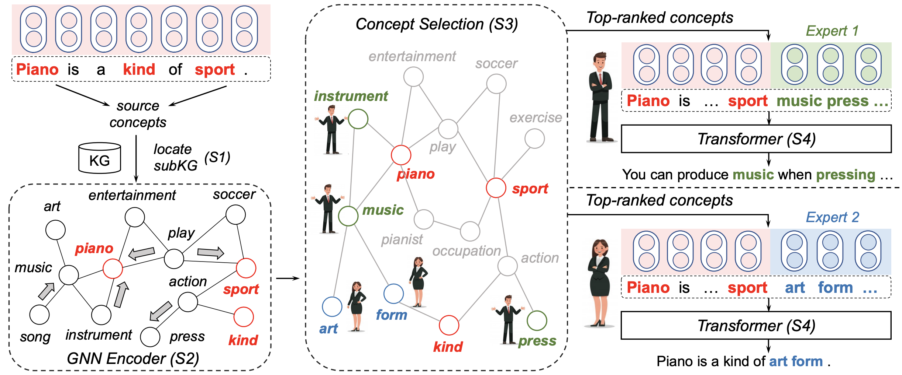

# Diversifying Content Generation for Commonsense Reasoning with Mixture of Knowledge Graph Experts

## Introduction

This is the pytorch implementation of our [ACL 2022](https://www.2022.aclweb.org/) paper "*Diversifying Content Generation for Commonsense Reasoning with Mixture of Knowledge Graph Experts*" [\[PDF\]](https://arxiv.org/abs/2203.07285). 
In this paper, we propose MoKGE, a novel method that diversifies the generative reasoning by a mixture of expert (MoE) strategy on commonsense knowledge graphs (KG). 
A set of knowledge experts seek diverse reasoning on KG to encourage various generation outputs.

 

## Requirements

```
transformers==3.3.1
torch==1.7.0
nltk==3.4.5
networkx==2.1
spacy==2.2.1
torch-scatter==2.0.5+${CUDA}
psutil==5.9.0
```

If `OSError: [E050] Can't find model 'en_core_web_sm'` occured:
```
python3 -m spacy download en_core_web_sm
```

For `torch-scatter`, `${CUDA}` should be replaced by either `cu101` `cu102` `cu110` or `cu111` depending on your PyTorch installation. 
For more information check [here](https://github.com/rusty1s/pytorch_scatter).


## Preprocessing

Preprocessed datasets can be downloaded from [here]().

Unzip the file and move it to `data`.

Extract English ConceptNet and build graph.

```bash
cd data
wget https://s3.amazonaws.com/conceptnet/downloads/2018/edges/conceptnet-assertions-5.6.0.csv.gz
gzip -d conceptnet-assertions-5.6.0.csv.gz
cd ../preprocess
python extract_cpnet.py
python graph_construction.py
```

Preprocessing multi-hop relational paths for the model. Set `$DATA` to either `anlg`, `eg`.

```bash
export DATA=eg
python ground_concepts_simple.py $DATA
python find_neighbours.py $DATA
python filter_triple.py $DATA
```

## Run Baseline

**Coming Soon! Very likely before end of March! Stay tuned!**

## Run MoKGE

**Coming Soon! Very likely before end of March! Stay tuned!**

## Citation

```
@inproceedings{yu2022diversifying,
  title={Diversifying Content Generation for Commonsense Reasoning with Mixture of Knowledge Graph Experts},
  author={Yu, Wenhao and Zhu, Chenguang and Qin, Lianhui and Zhang, Zhihan and Zhao, Tong and Jiang, Meng},
  booktitle={Findings of Annual Meeting of the Association for Computational Linguistics (ACL)},
  year={2022}
}
```

**Please kindly cite our paper if you find this paper and the codes helpful.**

## Acknowledgements

Many thanks to the Github repository of [Transformers](https://github.com/huggingface/transformers), [KagNet](https://github.com/INK-USC/KagNet) and [MultiGen](https://github.com/cdjhz/multigen). Part of our codes are modified based on their codes.
